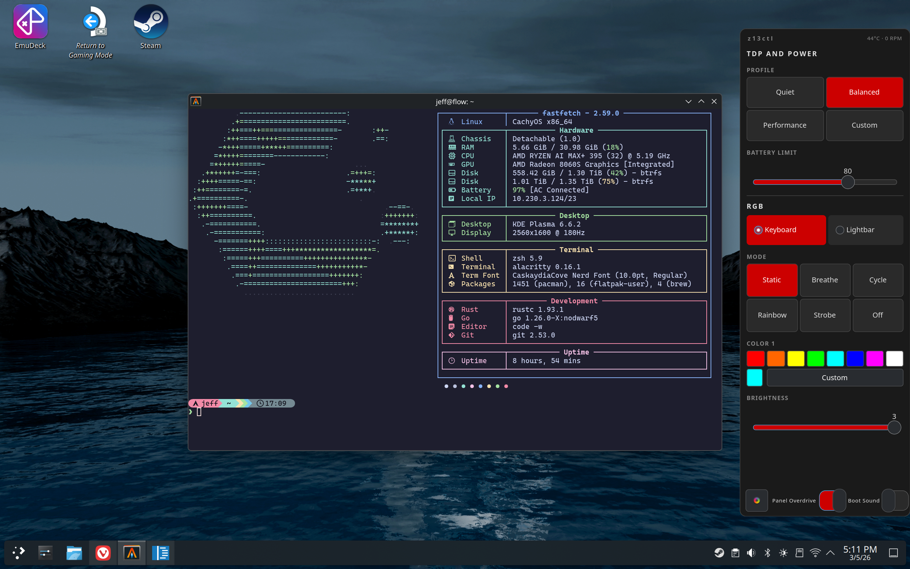

# voltaire-gui

GTK4 overlay drawer for [Voltaire](https://github.com/dahui/voltaire) on
Wayland. Formerly **z13gui**.

[](../LICENSE)



`voltaire-gui` is the graphical side of Voltaire — a slide-out drawer triggered
by the Armoury Crate button (KEY_PROG3). It renders as a Wayland layer-shell
overlay (KDE Plasma, Hyprland, Sway), as a transparent click-through overlay on
compositors without layer-shell (GNOME — see
[GNOME support](https://dahui.github.io/voltaire/gui/#gnome-support)), or as a
gamescope X11 overlay in Steam Gaming Mode. All hardware communication goes
through the voltaire daemon.

## Install

```sh
# Arch Linux (AUR)
yay -S voltaire-gui-bin

# Debian / Ubuntu
sudo apt install ./voltaire-gui_*.deb

# Fedora / RHEL
sudo dnf install ./voltaire-gui_*.rpm

# Manual (from release tarball)
tar xzf voltaire-gui_*_linux_amd64.tar.gz
sudo install -Dm755 voltaire-gui /usr/local/bin/voltaire-gui
```

See the [Installation guide](https://dahui.github.io/voltaire/installation/)
for systemd service setup, source builds, and uninstall instructions.

## Quick Start

Press the **Armoury Crate button** on your Z13 to open the drawer. Press it
again, click outside, or press Escape to close it.

The drawer controls profiles (including custom TDP, fan curve, and undervolt),
battery charge limit, RGB lighting (mode, color, speed, brightness), panel
overdrive, and boot sound. All changes are sent to the voltaire daemon
immediately and persist across reboots.

## Documentation

Full documentation at **<https://dahui.github.io/voltaire>**

- [Installation](https://dahui.github.io/voltaire/installation/)
- [GUI Overview](https://dahui.github.io/voltaire/gui/)
- [Quick Start](https://dahui.github.io/voltaire/gui/quick-start/)
- [Configuration](https://dahui.github.io/voltaire/gui/configuration/)
- [Theming](https://dahui.github.io/voltaire/gui/theming/)
- [Migrating from z13gui](https://dahui.github.io/voltaire/migrating-from-z13ctl/)
- [Contributing](https://dahui.github.io/voltaire/contributing/)

## License

[Apache 2.0](../LICENSE)
